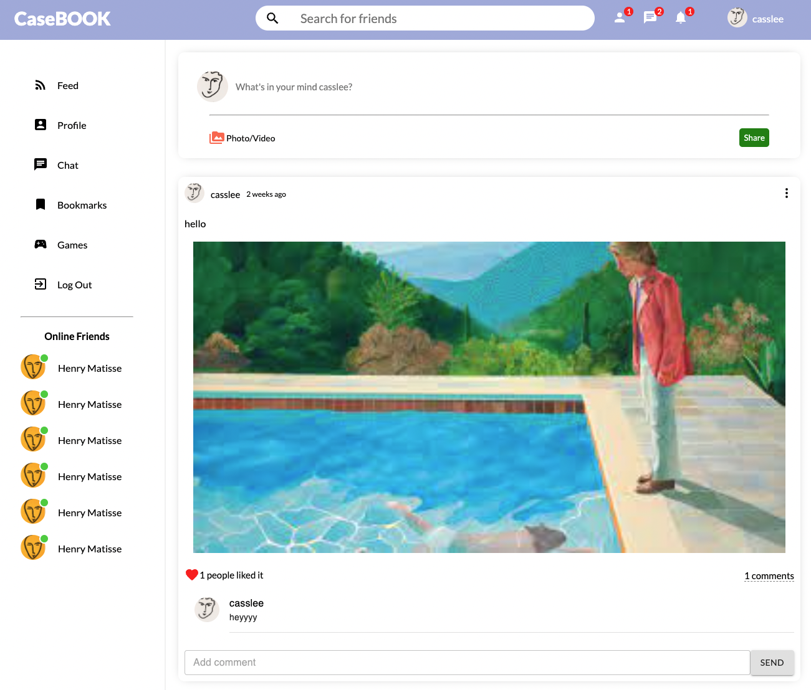

# CASEBOOK

DEMO: https://casebook.netlify.app/ 
REPO:  
**Frond-end: https://github.com/casslee8757/social-network-fe**  
**Back-end: https://github.com/casslee8757/social-network-be**

**About** 
This is the final project of the Software Engineering Immersive course from General Assembly Australia. This project is a social network app that was originally designed to have a followed-following function between users to communicate by creating, liking posts and leaving comments. The initial plan involved various features like followed-following, live chat between following users and live notification. However, due to the lack of time and unfamiliar tech stack, the planned features did not end up added to the final product.    

**Notable Features**

  * Create a post with an image using the Cloudinary widget
  * Like posts 
  * Leave comments on posts  
  * profile page

**Known bugs**

* When log in, the browser needs to be refreshed to go to the main page of the app.
* Search user that saved on the database 
  
**Whishlist**

* Followed - following feature
* Delete posts and comments
* Image preview when uploading the image
* Upload the user's profile image 

**Summary**

It was my first time building an app using the MERN stack. I have learnt React hook, MongoDB and Node.js through this project. It was quite a challenge for me to learn something new and build an app at the same time but I really enjoyed it. After finishing up the project, I have a better knowledge of the MERN stack and also gained confidence at the same time. 

Please use username: casslee and password: chicken to have a glance at the app.